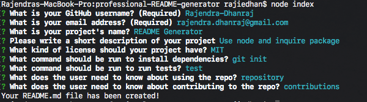
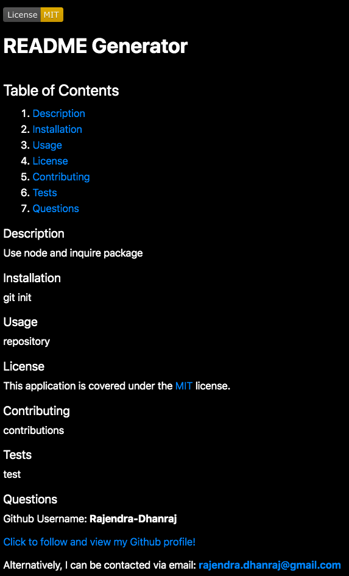

  

# **PROFESSIONAL README Generator**

  ## Table of Contents
  1. [Description](#description)
  2. [Demonstration](#demonstration)
  3. [License](#license)
  4. [Screenshots](#screenshots)
  5. [Questions](#questions)

### Description

User Story:
AS A developer I WANT a README generator
SO THAT I can quickly create a professional README for a new project.

This application was built using NODE.JS, Inquirer package and JavaScript.

### Demonstration

[Click to view application walkthrough](https://drive.google.com/file/d/1aNaoLGIgbZL3gf8OZnzzdnWuRtz0X9Ls/view)

### License

This application is covered under the [MIT](https://opensource.org/licenses/MIT) license.
  
### Screenshots

Visual of the command line inputs:

End result from the previous screenshot translated into README file:

### Questions

Github: **Rajendra-Dhanraj**

[Please click to view other projects and follow my Github page!](https://github.com/Rajendra-Dhanraj) 

Email for collaboration or questions: **rajendra.dhanraj@gmail.com**
